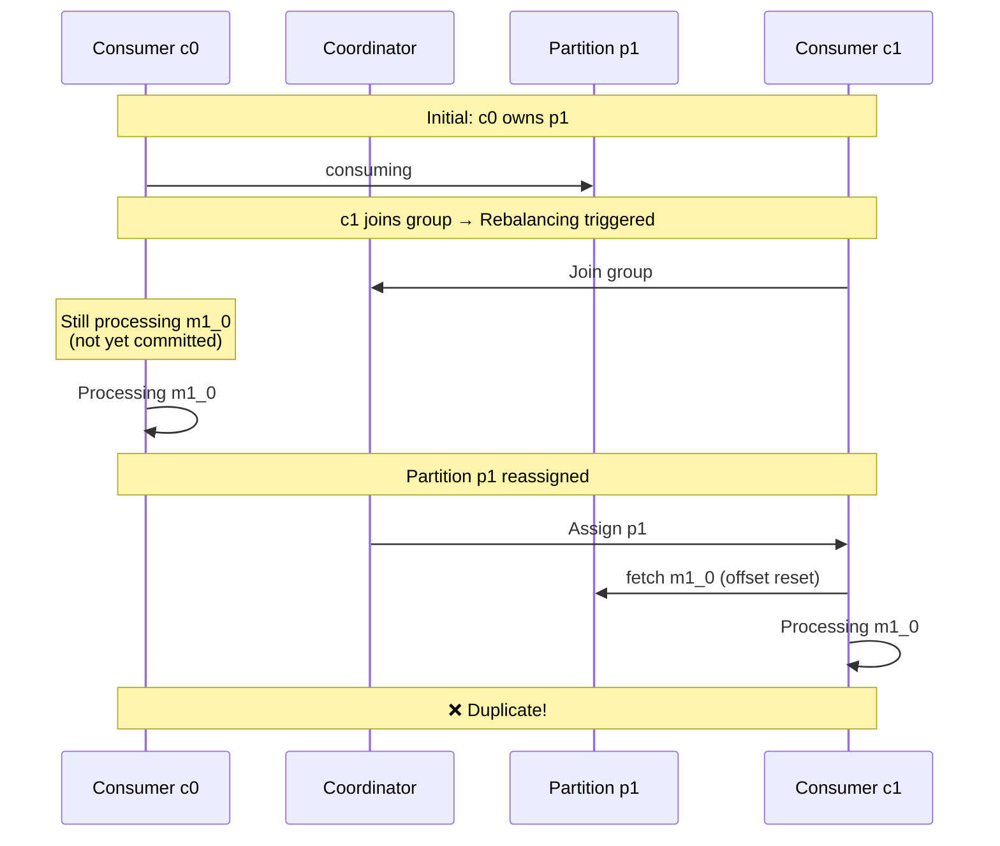

# Does Kafka hold revocation during rebalancing when a consumer is still processing messages?

## Introduction
Rebalancing is one of the trickiest parts of Kafka protocol that might cause data loss or corruption if it is not handled correctly. One of the questions you might ask is:
> What happens to processing thread (thread with poll() method) during rebalancing?

I once wondered whether messages could be processed twice during rebalancing. Imagine the following scenario with `eager` rebalancing enabled:

1. There is 1 consumer `c0` in a group consuming messages from a topic with 2 partitions `p0` and `p1`
2. A new consumer `c1` joins the group
3. Rebalancing is triggered
4. Partitions `p0` and `p1` are revoked from `c0`
5. During the rebalancing, `c0` is still processing message `m1_0` from `p1` but not yet committed
6. Partition `p1` is assigned to `c1`
7. `c1` starts processing message `m1_0` from `p1`
8. `m1_0` is processed twice

The following diagram illustrates the scenario:


In some cases, duplicate processing of messages is not a big deal. But in some cases, it can bring your whole business logic down. A good news for you is:
> The above scenario is not possible in Java consumer client as long as your processing time is less than max.poll.interval.ms

By saying Java consumer, I mean another variants of Kafka consumer clients may or may not offer the same guarantee. For example, there is a [bug](https://github.com/segmentio/kafka-go/issues/1398) that probably relates to this problem in `kafka-go` library from segmentio.

## How does Kafka hold revocation during rebalancing?

Before understanding the mechanism, make sure that you have a good understanding of Kafka rebalancing protocol. To summarize, Kafka consumers issue `JoinGroup` & `SyncGroup` requests to the coordinator to join a group and synchronize their state with the group with `synchronization barrier` mechanism.

As you might notice, Kafka introduces a concept called `synchronization barrier`. In short, it is a point in time when all consumers in a group reply that they completely halted their processing and ready to be revoked. Kafka only re-assigns partitions after `synchronization barrier` is reached.

In other words, if there is a consumer that is still processing messages, Kafka will not re-assign its partitions to other consumers. If nothing unexpected happens such as service crash in the middle, processing time exceeds max.poll.interval.ms, etc., a message is guaranteed to be processed only once during rebalancing.

### Let's read the code
Without proof, everything is just an assumption. So let's read the code to see if we can find any evidence of this behavior. A function that is responsible for joining and synchronizing a consumer to a group is `ensureActiveGroup` in [AbstractCoordinator](https://github.com/apache/kafka/blob/e9ff2cca859d7e5ffeec884696ad22138905ba32/clients/src/main/java/org/apache/kafka/clients/consumer/internals/AbstractCoordinator.java#L413).

```java
/**
 * Ensure the group is active (i.e., joined and synced)
 *
 * @param timer Timer bounding how long this method can block
 * @throws KafkaException if the callback throws exception
 * @return true iff the group is active
 */
boolean ensureActiveGroup(final Timer timer) {
    // always ensure that the coordinator is ready because we may have been disconnected
    // when sending heartbeats and does not necessarily require us to rejoin the group.
    if (!ensureCoordinatorReady(timer)) {
        return false;
    }

    startHeartbeatThreadIfNeeded();
    return joinGroupIfNeeded(timer);
}
```

This method is called in the `poll` loop, and the `poll` loop, most of the time, is only called when a current processing finishes. So if the consumer is still processing messages, the `ensureActiveGroup` method will not be called which implies that the consumer has not yet issued `JoinGroup` request to the coordinator.

If you are curious about correctness and want to run a POC against this behavior, you can add long thread sleep in the `poll` loop to simulate long-running processing. Once a new consumer joins the group, from heartbeat thread, you will see the following log:
```bash
ConsumerCoordinator: Request joining group due to: group is already rebalancing
```

This log indicates that the consumer has not yet issued `JoinGroup` request to the coordinator.

## `onPartitionRevoked` hook to the rescue

If you are using auto commit mode and manual synchronous commit, everything just works as expected. However, if you are using manual asynchronous commit, you need to be careful. Because the commit is asynchronous, there is a chance that partitions are revoked before the commit is completed, which, in turn, might cause duplicate processing of messages.

To address this case, you need to add a callback handler to the `onPartitionRevoked` method.
This method is guaranteed to be called at the start of rebalancing process and of course, before `synchronization barrier` is reached.

More importantly, `onPartitionRevoked` hook is called within a part of `poll()` thread (mentioned in this [docs](https://kafka.apache.org/26/javadoc/org/apache/kafka/clients/consumer/ConsumerRebalanceListener.html)). So you can safely assure that no processing is in progress when this hook is called.